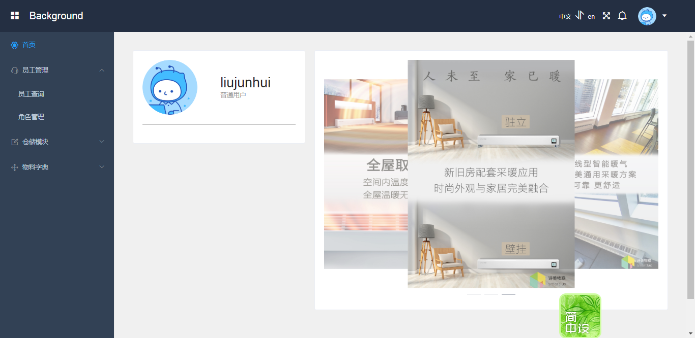

# nuxt-order

> 诗美物联智能家居

## Build Setup

``` bash
# install dependencies
$ npm install

# serve with hot reload at localhost:3000
$ npm run dev

# build for production and launch server
$ npm run build
$ npm start

# generate static project
$ npm run generate
```

For detailed explanation on how things work, checkout [Nuxt.js docs](https://nuxtjs.org).
****
这是一款基于 nuxt，mock，axios，element-ui,i18n,开发的后台管理项目

>友情链接 [诗美物联]（http://smartlux.com.cn)

